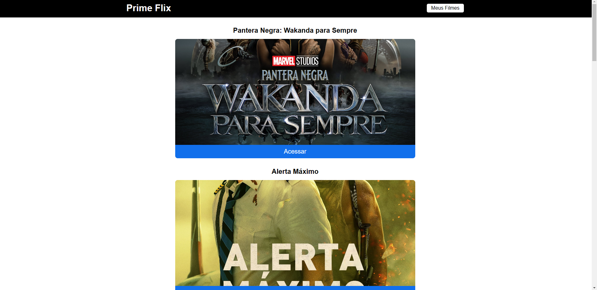
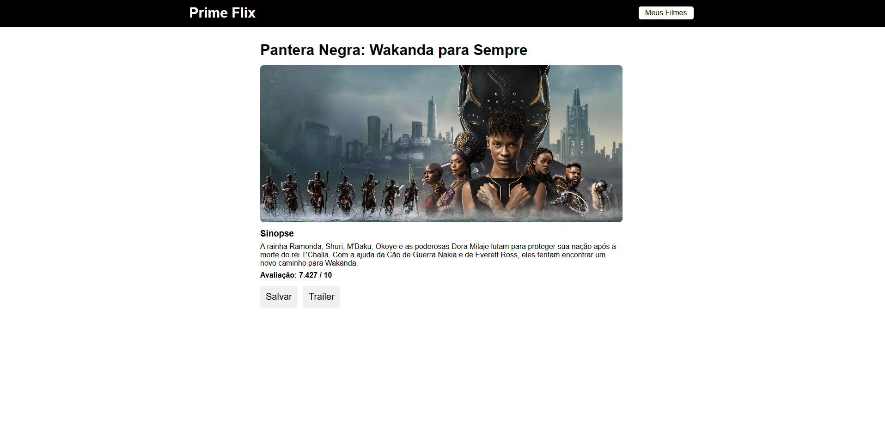
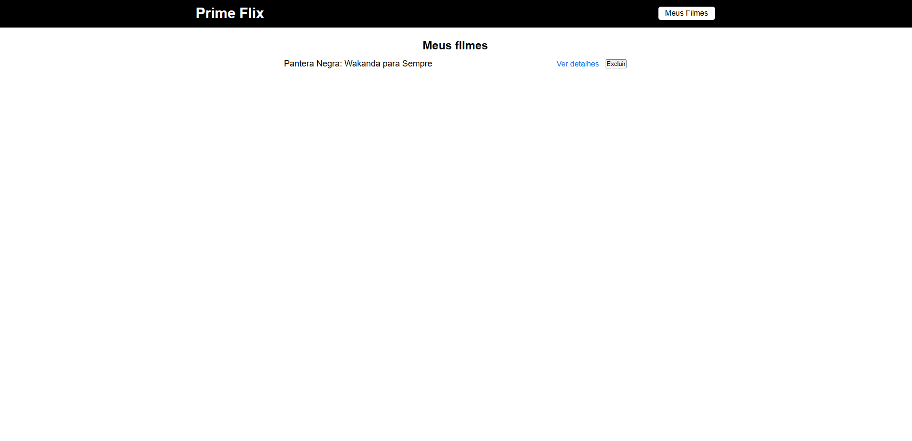

<h2 align="center">Filmes utilizando API</h2> 

### 🔖 Sobre

---

O projeto **Filmes utilizando API** é um site que foi criado para treinamento do curso de **Introdução ao React**. O site foi desenvolvido em React com API, salvando no **Local Storage**.  

### 🚀 Tecnologias utilizadas

---

O projeto foi desenvolvido utilizando as seguintes tecnologias

-   [React](https://pt-br.reactjs.org/)
-   [API](https://api.themoviedb.org/3/movie/550?api_key=d0015a5bf82d965fda69ef7f209dd27c)  

### 🖥️ Screens

---

Tela de início:
  
Tela de acesso ao filme:
  
Tela de filmes salvos:
  

### 😎 Publicado no Netlify

---

  

### 🔽 Possui

---

-   ✅ Requisição (API);
-   ✅ Trailer específico de cada filme;
-   ✅ Salvar filme nos favoritos;
-   ✅ Excluir filme dos favoritos.  

### 🤵 Autor

---

Desenvolvido com 💙 por Bruno Pereira.

